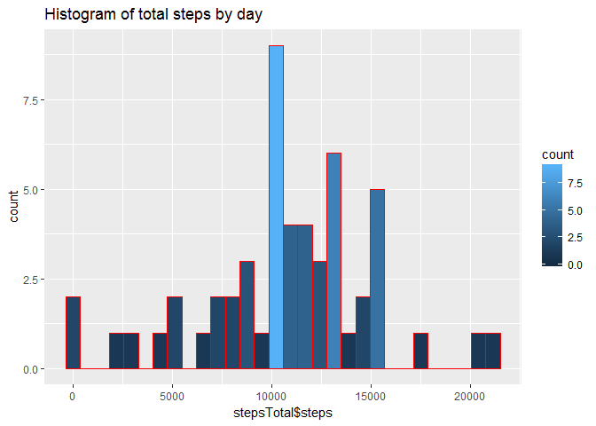

# Reproducible Research: Peer Assessment 1

This is markdown document addressing peer assigment 1 from "Reproducilbe Research"

## Loading and preprocessing the data
Lets read data from the zip file

```r
dataDF<-read.csv(unz("repdata_data_activity.zip","activity.csv"), na.strings = c("","NA"))
dataDF$date<-as.Date(dataDF$date)
```


## What is mean total number of steps taken per day?
Time to calculate total number of steps taken each day

```
##          date steps
## 1  2012-10-02   126
## 2  2012-10-03 11352
## 3  2012-10-04 12116
## 4  2012-10-05 13294
## 5  2012-10-06 15420
## 6  2012-10-07 11015
## 7  2012-10-09 12811
## 8  2012-10-10  9900
## 9  2012-10-11 10304
## 10 2012-10-12 17382
## 11 2012-10-13 12426
## 12 2012-10-14 15098
## 13 2012-10-15 10139
## 14 2012-10-16 15084
## 15 2012-10-17 13452
## 16 2012-10-18 10056
## 17 2012-10-19 11829
## 18 2012-10-20 10395
## 19 2012-10-21  8821
## 20 2012-10-22 13460
## 21 2012-10-23  8918
## 22 2012-10-24  8355
## 23 2012-10-25  2492
## 24 2012-10-26  6778
## 25 2012-10-27 10119
## 26 2012-10-28 11458
## 27 2012-10-29  5018
## 28 2012-10-30  9819
## 29 2012-10-31 15414
## 30 2012-11-02 10600
## 31 2012-11-03 10571
## 32 2012-11-05 10439
## 33 2012-11-06  8334
## 34 2012-11-07 12883
## 35 2012-11-08  3219
## 36 2012-11-11 12608
## 37 2012-11-12 10765
## 38 2012-11-13  7336
## 39 2012-11-15    41
## 40 2012-11-16  5441
## 41 2012-11-17 14339
## 42 2012-11-18 15110
## 43 2012-11-19  8841
## 44 2012-11-20  4472
## 45 2012-11-21 12787
## 46 2012-11-22 20427
## 47 2012-11-23 21194
## 48 2012-11-24 14478
## 49 2012-11-25 11834
## 50 2012-11-26 11162
## 51 2012-11-27 13646
## 52 2012-11-28 10183
## 53 2012-11-29  7047
```

Now, let's plot histogram of total steps by day
<!-- -->

Mean of the total number of steps taken per day:

```
## [1] 10766.19
```
Median of the total number of steps taken per day:

```
## [1] 10765
```

## What is the average daily activity pattern?

We are going to plot time series plot with average number of steps by day.
<!-- -->

Which 5-minute interval, on avarage across all the days in the dataset, contains the maximum number of steps?

```
## [1] 835
```


## Imputing missing values
Time to handle missing values (if I can ;) )
Calculating the total number of missing values in the dataset

```r
sum(is.na(dataDF$steps))
```

```
## [1] 2304
```

The strategy for filling in all the missing values in the dataset. Super simple approach - I take average number of steps for the interval.
"stepsAvg" holds number of steps by interval. 

```
##     interval          steps        
##  Min.   :   0.0   Min.   :  0.000  
##  1st Qu.: 588.8   1st Qu.:  2.486  
##  Median :1177.5   Median : 34.113  
##  Mean   :1177.5   Mean   : 37.383  
##  3rd Qu.:1766.2   3rd Qu.: 52.835  
##  Max.   :2355.0   Max.   :206.170
```

A new dataset is created like this:

```r
library(plyr)
names(stepsAvg)[2]<-"stepsmean"
dataDFFixed<-join(dataDF,stepsAvg,by="interval",type="inner")
dataDFFixed$steps<-ifelse(is.na(dataDFFixed$steps),as.integer(dataDFFixed$stepsmean), dataDFFixed$steps)
dataDFFixed<-dataDFFixed[,1:3]
```
The dataset has been fixed, we will plot histogram now:
<!-- -->

Mean of the total number of steps taken per day for fixed dataset:

```
## [1] 10749.77
```
Median of the total number of steps taken per day for fixed dataset:

```
## [1] 10641
```

As we can see the histogram and mean/median are quite different. The average number of steps gor lower!


## Are there differences in activity patterns between weekdays and weekends?
We are going to create a new dataset that will have weekday factor.

```r
dataDFFixed$weekpart<-ifelse(weekdays(dataDFFixed$date) %in% c("Saturday","Sunday"), "weekend", "weekday")
```

Panel plot with time series plots of the 5-minute interval and the average steps taken, averaged across all weekday days or weekend days
<!-- -->
```

